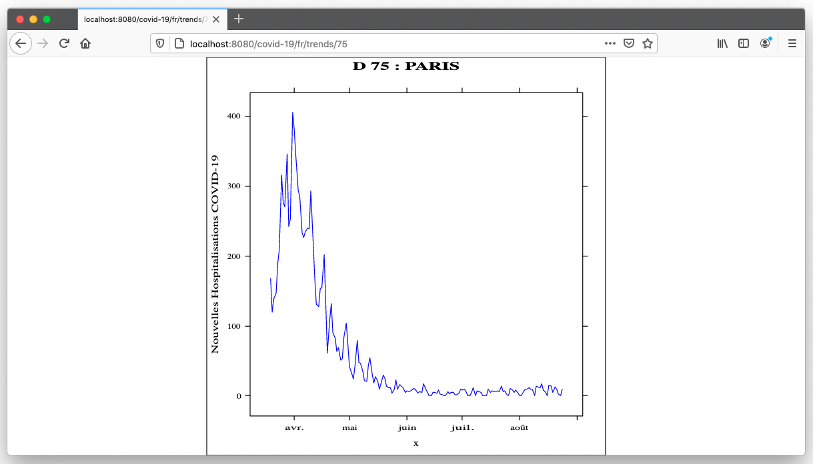

# Helidon MP Polyglot Demo

Sample Helidon MP project that includes multiple REST operations with various implementations languages  to showcase GraalVM Polyglot features.
The application provides an Helidon Microservices that enables users to visualize a Covid-19 evolution in France, This application relies on data provided by the French National Health Agency ( Santé Publique France).

* Java
* R
* Python
* C
* Javascript


## Setup GraalVM :rocket:

Download GraalVM latest binaries from https://www.graalvm.org/downloads
```bash
tar -zxf ~/Downloads/graalvm-ce-java11-darwin-amd64-20.2.0.tar.gz  -C ~/Applications/Java/
export GRAALVM_HOME=~/Applications/Java/graalvm-ce-java11-20.2.0/Contents/Home
export JAVA_HOME=$GRAALVM_HOME
export PATH=$PATH:$GRAALVM_HOME/bin
export LLVM_TOOLCHAIN=$(lli --print-toolchain-path)

```
Install GraalVM addons for `native-image` ,`python`, `R` 
```
$GRAALVM_HOME/bin/gu install python R native-image
```
GraalVM component list should look like:
```bash
$GRAALVM_HOME/bin/gu list
ComponentId              Version             Component name      Origin
--------------------------------------------------------------------------------
js                       20.2.0              Graal.js
graalvm                  20.2.0              GraalVM Core
R                        20.2.0              FastR               github.com
llvm-toolchain           20.2.0              LLVM.org toolchain  github.com
native-image             20.2.0              Native Image        github.com
python                   20.2.0              Graal.Python        github.com
```
You may also need to configure fastR with some GraalVM versions using 
```bash 
$GRAALVM_HOME/languages/R/bin/configure_fastr
```


## Build and run

Get the source code from Github
```bash
git clone https://github.com/nelvadas/helidon-polyglot-demo.git

```


### Build the C lib dependency
The downloadstatus.c file ensure the covid-data.csv  local file is present on the host and prints its total size  

```bash
$LLVM_TOOLCHAIN/clang downloadstatus.c -o downloadstatus

./downloadstatus /tmp/covid-data.csv
Checking the downloaded file!
/tmp/covid-data.csv file attributes : size: 364782 bytes, last modified: 1597935473

```

### Add custom Certs to Graal
In this tutorial, we are manipulating data provided by the French National Health Agency (https://www.data.gouv.fr/fr/datasets/r/6fadff46-9efd-4c53-942a-54aca783c30c),
We will be using a Java code to automatically download the daily file that reports the new covid-19 cases by french departement.
Get the certificate with the following command.

```
openssl s_client -showcerts -connect www.data.gouv.fr:443 </dev/null 2>/dev/null|openssl x509 -outform PEM > datagouvfr.pem
```
In case you do not have openssl, you can download the file from source code [datagouvfr.pem](https://raw.githubusercontent.com/nelvadas/helidon-polyglot-demo/master/datagouvfr.pem)

Import this file in your $GRAALVM cacert 
```
keytool  -importcert  \
-file datagouvfr.pem \
-alias datagouvfr \
-keystore $GRAALVM_HOME/lib/security/cacerts \
-storepass changeit -trustcacerts -noprompt
```
:point_right: For Java8 check the caccert path `$GRAALVM_HOME/jre/lib/security`


### Build the helidon JAR
With JDK11+
```bash
cd helidon-polyglot-demo
mvn package
$java -Dapp.covid.rscript=$(pwd)/scripts/covidgraph.R \
            -Dapp.covid.cscript=$(pwd)/scripts/downloadstatus \
            -Dapp.covid.pyscript=$(pwd)/scripts/department.py \
            -jar target/helidon-polyglot-demo.jar
```

Console  should display message like the following saying the servers starts on the default port 8080.:fire::fire::fire:

```json
2020.08.24 17:18:08 INFO io.helidon.webserver.NettyWebServer Thread[nioEventLoopGroup-2-1,10,main]: Channel '@default' started: [id: 0xc61d3b46, L:/0:0:0:0:0:0:0:0:8080]
2020.08.24 17:18:08 INFO io.helidon.microprofile.server.ServerCdiExtension Thread[main,5,main]: Server started on http://localhost:8080 (and all other host addresses) in 2203 milliseconds (since JVM startup).
2020.08.24 17:18:08 INFO io.helidon.common.HelidonFeatures Thread[features-thread,5,main]: Helidon MP 2.0.1 features: [CDI, Config, Fault Tolerance, Health, JAX-RS, Metrics, Open API, Security, Server, Tracing]
```


## Exercise the application 

##### Download the covid-19 sample Data (`Java`)
```
curl -X GET http://localhost:8080/covid-19/fr/download

```
This endpoint download the most recent dataset from French Health agency and save it on local path `/tmp/covid-data.csv`( )

```
2020.08.24 18:03:44 INFO org.graalvm.demo.CovidResource Thread[helidon-1,5,server]: localpath =/TMP/COVID-DATA.CSV
```
This file contains information about new covid-19 cases in  French:fr: departments and territories since  :date: March 19th 2020.

```
$head covid-data.csv
dep;jour;incid_hosp;incid_rea;incid_dc;incid_rad
01;2020-03-19;1;0;0;0
01;2020-03-20;0;0;0;1
01;2020-03-21;3;0;0;0
01;2020-03-22;3;1;0;1
01;2020-03-23;14;1;0;5
01;2020-03-24;11;1;0;4
01;2020-03-25;13;2;0;5
01;2020-03-26;14;3;2;2
01;2020-03-27;14;2;0;0
```


##### Check the download status (`C code`)
```
curl -X  GET -I  http://localhost:8080/covid-19/fr/download/status

```
This endpoint checks the local dataset is properly download, 
:-1: in case of failure while downloading  it returns an `HTTP 500` code.


Checking the downloaded file!
/tmp/covid-data.csv file attributes : size: 374122 bytes, last modified: 1598285024
2020.08.24 18:08:00 INFO org.graalvm.demo.CovidResource Thread[helidon-2,5,server]: 
[SUCCES] Downloaded file https://www.data.gouv.fr/fr/datasets/r/6fadff46-9efd-4c53-942a-54aca783c30c to /tmp/covid-data.csv


```shell 
(base) $ls -rtl /tmp/covid-data.csv
-rw-r--r--  1 enonowog  wheel  374122 24 aoû 18:03 /tmp/covid-data.csv
```
#### Retreive departement Names by Id (`python code`)

```
curl -X GET http://localhost:8080/covid-19/fr/department/75
PARIS
```
The python scripts provides a function that gives a department names based on its id
```python
import polyglot

dnames={
"01":  "AIN",
"02":  "AISNE",
...
}

@polyglot.export_value
def getDepartmentNameById(deptId):
  if deptId in dnames:
      return dnames[deptId]
  else:
    return "-"
```

#### Covid-19  hospitalization trend per department   (`R code + Java +Javacript+ Python`)

From your browser open [http://localhost:8080/covid-19/fr/trends/75](http://localhost:8080/covid-19/fr/trends/75)



The new covid-19 cases is ploted using R and a two utilities functions: 
* The python script is used to retreive department name
* a javascript function that properly format department sent on One digit 
```javascript
polyglot.eval("js",(" function patchDeptId (deptId) { if(deptId.length==1) {return `0`+deptId } else return deptId } "));
eg.  1 => 01, 2=>02 ... 9=>09 , 75 remains 75 

```
* R `xyplot` function is used display trends from the csv data


```json 
Server logs...
...
/tmp/covid-data.csv
running with departmentId=75 in JavaScript!
Loading required package: lattice
...
print(g1)
grDevices:::svg.off()
}
[polyglot value]
[1] "75"
[polyglot value]
[1] "PARIS"
[polyglot value]
[1] "/tmp/covid-data.csv"


```

You can repeat the operation with various French departements
`75 (Paris), 78 (Yvelines) ...`


### Try health and metrics

```
curl -s -X GET http://localhost:8080/health
{"outcome":"UP",...
. . .
```

## Build the Docker Image  :whale:

```
docker build -t helidon-polyglot-demo .
```

## Start the application with Docker

```
docker run --rm -p 8081:8080 helidon-polyglot-demo:latest
```

Exercise the application as described above


1. Download /tmp/covid-data.csv 

```
curl -s -X GET http://localhost:8081/covid-19/fr/download

```
2. Check trends for another departement 
```
http://localhost:8081/covid-19/fr/trends/78
```